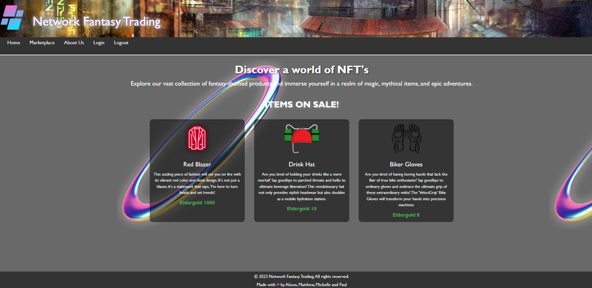
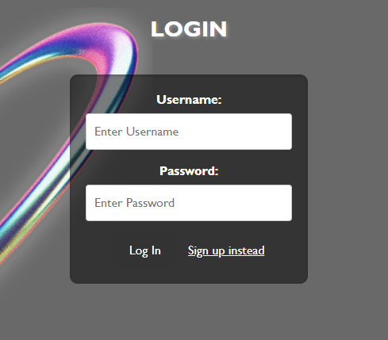
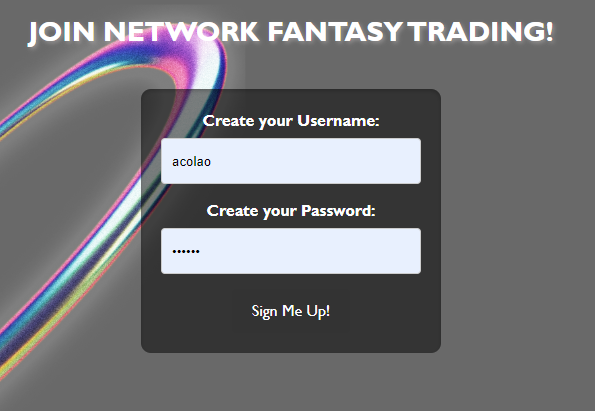
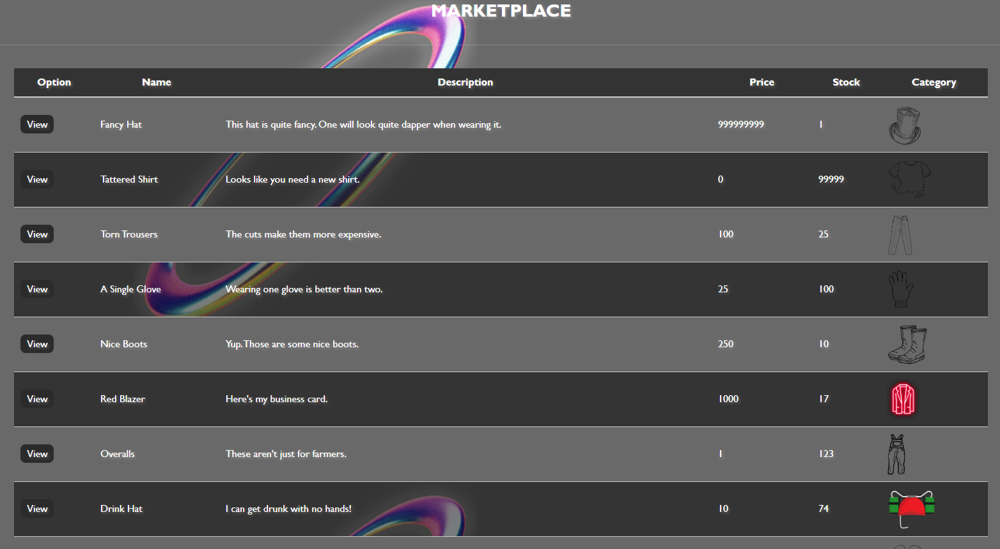
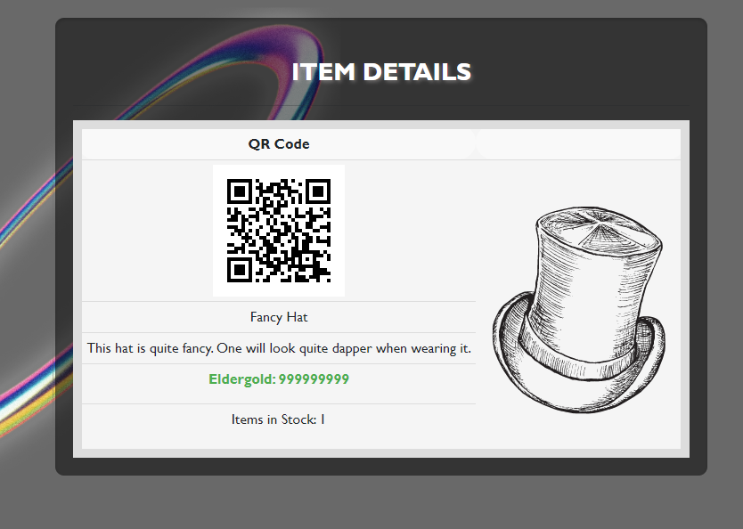

# Network Fantasy Trading - NFT-marketplace

The project aims to develop a backend and frontend application for a virtual marketplace where users can browse, view, and buy virtual items. The application will be built using Node.js with the Express framework, utilizing Sequelize as an ORM (Object-Relational Mapping) library to interact with a MySQL database. JavaScript will be the primary programming language used for implementing the backend logic.

## Tech

Node.js 

Express

Sequelize

Javascript 

HTML/CSS/Handlebars 

QR-Code NPM-module to create QR-Codes for all unique items.

## Usage

1. Go to the home page

2. If you are a registered user, login.

...otherwise, click the "Sign Up Instead" button and you will be redirected to create a username and password.

2. Next you can browse items available for sale on the Marketplace page. 

3. Once you have selected items, you can review the item image, item description, price (in Eldergold), QR code, and how many are in stock.

## Installation

Live Deployment through Heroku!

Herokulink

    
## Authors

Alison Colao 
https://github.com/acolao

Matthew Gracia 
https://github.com/MatthewGracia

Michelle von Franzke 
https://github.com/mvfranzke

Paul Kuhn 
https://github.com/pakuhn93

NFT-marketplace repository:

https://github.com/pakuhn93/NFT-marketplace.git

